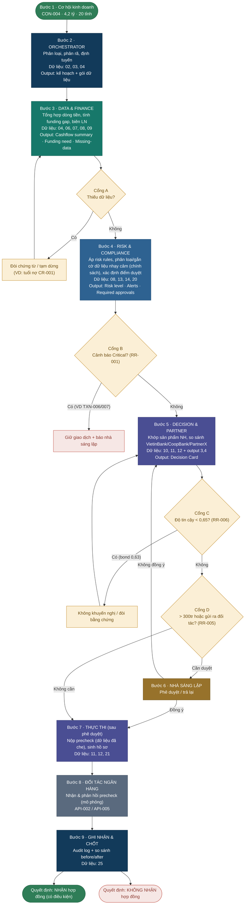

# OPC — Quy trình nghiệp vụ (nguồn Mermaid để chỉnh sửa)

Dán đoạn code dưới vào **mermaid.live**, **VS Code (extension Mermaid Preview)**, hoặc **draw.io (Insert → Advanced → Mermaid)** để render và tùy chỉnh cho báo cáo.

Đây là bản **flowchart có cổng quyết định** (bổ trợ cho bản swimlane). Nếu cần đúng dạng swimlane (lane theo tác nhân) trong báo cáo, khuyến nghị vẽ lại bằng draw.io/Lucidchart để kiểm soát bố cục tốt hơn.

## Chú thích mã sheet (Team Pack)
- 02 OPC_PROFILE · 03 CUSTOMERS · 04 CONTRACTS · 06 ORDERS · 07 INVOICES
- 08 BANK_TXN · 09 CASHFLOW · 10 CREDIT_PROFILE · 11 BANK_PRODUCTS · 12 API_CATALOG
- 13 RISK_RULES · 14 ALERTS · 20 DATA_CLASS · 21 MASKING_EXAMPLES · 25 RUNTIME_LOG_SCHEMA

## Lớp Governance xuyên suốt (cross-cutting)
- **Che/token hoá dữ liệu** (CUS-005 → TOK-CUS-A91F): **thực thi tự động tại ranh giới tin cậy** (mỗi lần gọi API ngoài/LLM ngoài — Bước 7, 8). Risk & Compliance chỉ *định nghĩa chính sách* (sheet 20/21), không tự thực thi.
- **Audit log** (sheet 25): ghi nhận ở **mọi bước**.
- Đây là control **không thuộc riêng agent nào** — nên vẽ dưới dạng dải/nền bao trùm, hoặc chú thích riêng.

## 4 cổng kiểm soát (governance)
- **Cổng A** — thiếu dữ liệu → đòi chứng từ (PUB-002).
- **Cổng B** — cảnh báo Critical (RR-001) → giữ giao dịch + human-in-the-loop.
- **Cổng C** — độ tin cậy < 0,65 (RR-006) → không khuyến nghị.
- **Cổng D** — >300 triệu hoặc gửi hồ sơ ra đối tác (RR-005 / quy tắc OPC) → nhà sáng lập phê duyệt.
